# TaskFlow

TaskFlow is a full-stack task management application designed to help users organize their work, track progress, and manage tasks through a simple and focused dashboard.

The application allows users to create an account, sign in securely, create and organize tasks, assign tasks to categories, track task status and priority, and monitor overall progress from a dashboard.

The project was designed with a focus on clarity, usability, maintainability, and separation between the user interface, application logic, and data storage.

> **Project status:** The frontend application and its automated tests are implemented and passing. A live production deployment is not currently available. The application can be reviewed locally using the setup instructions below.

---

## Table of Contents

* [TaskFlow](#taskflow)
* [Project Overview](#project-overview)
* [Task Flow](#task-flow)
* [Features](#features)
* [Technology Stack](#technology-stack)
* [How the Application Works](#how-the-application-works)
* [Project Structure](#project-structure)
* [Prerequisites](#prerequisites)
* [Getting Started](#getting-started)
* [Environment Variables](#environment-variables)
* [Running the Frontend](#running-the-frontend)
* [Running the Backend](#running-the-backend)
* [Running the Tests](#running-the-tests)
* [Application Screenshots](#application-screenshots)
* [System Architecture](#system-architecture)
* [API Documentation](#api-documentation)
* [Data Model](#data-model)
* [User Flows](#user-flows)
* [Design Decisions and Trade-offs](#design-decisions-and-trade-offs)
* [Known Limitations](#known-limitations)
* [Future Enhancements](#future-enhancements)
* [Documentation](#documentation)
* [Live Demo](#live-demo)

---

## Project Overview

TaskFlow addresses a simple but common problem: keeping track of tasks becomes difficult when tasks are scattered across different notes, applications, or mental reminders.

The goal of TaskFlow is to provide one place where a user can:

1. Create and manage an account.
2. Create tasks.
3. Assign tasks to categories.
4. Set task priorities.
5. Track whether work is still to do, in progress, or completed.
6. View task information from a central dashboard.
7. Monitor overall completion progress.
8. Keep personal task information separated between users.

The application is intentionally focused on the core task-management experience rather than attempting to become a large project-management platform.

---

# Task Flow

The main user journey is:

```text
Register
   |
   v
Login
   |
   v
Dashboard
   |
   +------------------+
   |                  |
   v                  v
Tasks             Categories
   |                  |
   v                  v
Create Task       Create Category
   |
   v
Set Priority / Status / Category
   |
   v
Track Progress
   |
   v
Complete Task
```

A new user first creates an account and signs in.

After authentication, the user reaches the dashboard. The dashboard provides a quick overview of task progress and acts as the main starting point for managing tasks.

From there, the user can navigate to the tasks area to create, view, update, filter, and manage tasks.

Categories provide another layer of organization. A user can create categories such as Work, Personal, Health, or Learning and associate tasks with them.

The complete user flows are documented separately:

* [Authentication Flow](docs/user-flows.md)
* [Dashboard Flow](docs/user-flows.md)
* [Task Flow](docs/user-flows.md)
* [Category Flow](docs/user-flows.md)

Visual flow diagrams are available in the `docs/images` directory.

---

# Features

## Authentication

TaskFlow provides a dedicated authentication flow for users.

Users can:

* Register for an account.
* Log in using their credentials.
* Receive appropriate feedback when authentication fails.
* Access protected application areas after authentication.

The authentication screens were designed to keep the process simple and understandable.

See:

* [Authentication Requirements](docs/requirements.md)
* [Authentication User Flow](docs/user-flows.md)
* [Authentication Wireframes](docs/ui-wireframes.md)

---

## Dashboard

The dashboard gives the user an immediate overview of their work.

It provides summary information including:

* Total tasks.
* Completed tasks.
* Tasks still to do.
* Tasks currently in progress.
* Completion percentage.

This means the user does not need to open every task individually just to understand their overall progress.

---

## Task Management

Users can manage their tasks through the task management interface.

Tasks support information such as:

* Title.
* Description.
* Status.
* Priority.
* Category.
* Due date.

Users can:

* Create tasks.
* View tasks.
* Update tasks.
* Change task status.
* Filter tasks.
* Delete tasks.
* Navigate through paginated task lists.

Task status is intentionally kept simple:

* To Do
* In Progress
* Done

An overdue task is treated as a task condition derived from its due date rather than being introduced as a fourth permanent task status.

---

## Category Management

Categories help users organize related tasks.

Examples include:

* Work
* Personal
* Health
* Learning

Users can view their categories and see how many tasks belong to each category.

Category progress is represented visually so that users can quickly understand how much work is associated with each category.

---

## Task Priority

Tasks can have different priority levels so users can distinguish urgent work from less important work.

Priority is displayed visually within the task interface to make scanning a task list easier.

---

## Filtering

The task interface supports filtering tasks by their status.

This allows a user to quickly answer questions such as:

* Which tasks have I not started?
* Which tasks am I currently working on?
* Which tasks have I already completed?

---

## Pagination

Task lists support pagination rather than attempting to display every task at once.

This keeps the interface manageable as the number of tasks grows.

---

## Empty and Error States

The application includes explicit states for situations where there is nothing to display or something goes wrong.

Examples include:

* No tasks.
* No categories.
* Failed data loading.
* Authentication errors.

Instead of leaving the user with a blank screen, the interface explains what happened and, where appropriate, provides a next action.

---

# Technology Stack

## Frontend

* Next.js
* React
* TypeScript
* Tailwind CSS
* Vitest
* React Testing Library

The frontend is responsible for displaying the application, handling user interaction, managing UI state, and communicating with the backend API.

## Backend

* Python
* FastAPI
* PostgreSQL

The backend is responsible for application logic, authentication, validation, data access, and exposing the API consumed by the frontend.

## Database

PostgreSQL is used as the relational database.

The main entities are:

* Users
* Tasks
* Categories

Their relationships and constraints are documented in:

[Data Model](docs/data-model.md)

## Testing

Frontend behavior is tested using:

* Vitest
* React Testing Library

The test suite covers important UI behavior including:

* Authentication forms.
* Dashboard rendering.
* Task management.
* Task filtering.
* Task pagination.
* Task rows.
* Task status and priority.
* Category rendering.
* Category task counts.
* Empty states.
* Error states.
* Reusable UI components.

---

# How the Application Works

At a high level, TaskFlow is divided into three main parts.

```text
+----------------------+
|      Frontend        |
|      Next.js         |
|      React           |
+----------+-----------+
           |
           | HTTP / API
           v
+----------------------+
|       Backend        |
|       FastAPI        |
| Application Logic    |
+----------+-----------+
           |
           | Database Queries
           v
+----------------------+
|      PostgreSQL      |
|      Database        |
+----------------------+
```

The frontend is what the user interacts with.

The backend acts as the middle layer between the interface and the database. It validates requests, applies application rules, and determines what data the user is allowed to access.

The database stores the persistent application data.

This separation makes it possible to change the user interface without having to redesign the entire data layer.

---

# Project Structure

The repository is organized into separate areas for the frontend, backend, and documentation.

```text
TaskFlow/
│
├── frontend/
│   ├── app/
│   ├── components/
│   ├── hooks/
│   ├── tests/
│   └── ...
│
├── backend/
│   └── ...
│
├── docs/
│   ├── images/
│   │   ├── wireframes/
│   │   │   ├── categories.png
│   │   │   ├── create-category.png
│   │   │   ├── create-task.png
│   │   │   ├── dashboard.png
│   │   │   ├── edit-task.png
│   │   │   ├── empty-dashboard.png
│   │   │   ├── login.png
│   │   │   ├── registration.png
│   │   │   └── task-details.png
│   │   │
│   │   ├── authentication-flow.png
│   │   ├── categories-flow.png
│   │   ├── dashboard-flow.png
│   │   ├── erd.png
│   │   └── system-architecture.png
│   │
│   ├── api.md
│   ├── architecture.md
│   ├── data-model.md
│   ├── requirements.md
│   ├── ui-wireframes.md
│   ├── user-flows.md
│   └── user-stories.md
│
├── .env.example
├── .gitignore
└── README.md
```

The exact implementation may contain additional files, but the separation of responsibilities remains the same.

---

# Prerequisites

Before running TaskFlow locally, install the following software.

## Required

### Git

Git is required to download the project source code.

Verify the installation:

```bash
git --version
```

### Node.js

The frontend requires Node.js.

Verify the installation:

```bash
node --version
npm --version
```

A current LTS version of Node.js is recommended.

### Python

The backend requires Python.

Verify the installation:

```bash
python --version
```

Python 3.11 or a compatible supported version is recommended.

### PostgreSQL

The backend uses PostgreSQL for persistent application data.

Verify that PostgreSQL is installed and available.

You will also need:

* A PostgreSQL server.
* A PostgreSQL database.
* A PostgreSQL user with permission to access that database.

---

# Getting Started

## 1. Clone the repository

Open a terminal and run:

```bash
git clone <[REPOSITORY_URL](https://github.com/paulathejennifer/TaskFlow)>
```

Then enter the project directory:

```bash
cd TaskFlow
```

---

# Running the Frontend

Open a terminal in the project root and enter the frontend directory:

```bash
cd frontend
```

Install the frontend dependencies:

```bash
npm install
```

Create the frontend environment file if required:

```bash
copy .env.example .env.local
```

On macOS or Linux:

```bash
cp .env.example .env.local
```

Add the required environment values to `.env.local`.

Then start the development server:

```bash
npm run dev
```

The terminal will display the local address used by Next.js.

Open that address in a browser.

The frontend can then be reviewed locally.

---

# Running the Backend

Open a second terminal.

From the project root:

```bash
cd backend
```

Create a Python virtual environment:

```bash
python -m venv .venv
```

Activate it on Windows PowerShell:

```powershell
.venv\Scripts\Activate.ps1
```

On macOS or Linux:

```bash
source .venv/bin/activate
```

Install the backend dependencies:

```bash
pip install -r requirements.txt
```

Create the backend environment file:

```bash
copy .env.example .env
```

On macOS or Linux:

```bash
cp .env.example .env
```

Configure the database connection and other required backend environment variables.

Then start the FastAPI development server using the backend's application entry point.

For example:

```bash
uvicorn app.main:app --reload
```

If the backend entry point in the repository differs from this example, use the entry point specified by the backend application configuration.

FastAPI normally exposes interactive API documentation at:

```text
http://127.0.0.1:8000/docs
```

---

# Environment Variables

Environment variables keep configuration such as database credentials and API addresses outside the source code.

A `.env.example` file should be provided as a template.

Typical configuration includes:

```text
DATABASE_URL=
SECRET_KEY=
NEXT_PUBLIC_API_URL=
```

Do not commit real secrets to Git.

The `.env.example` file should contain example variable names but should not contain real passwords, secret keys, or private credentials.

---

# Database Setup

TaskFlow uses PostgreSQL to persist application data.

Create a PostgreSQL database before starting the backend.

For example:

```sql
CREATE DATABASE taskflow;
```

Then configure the database connection in the backend environment file.

The database model is documented here:

[Data Model](docs/data-model.md)

The entity relationship diagram is available here:

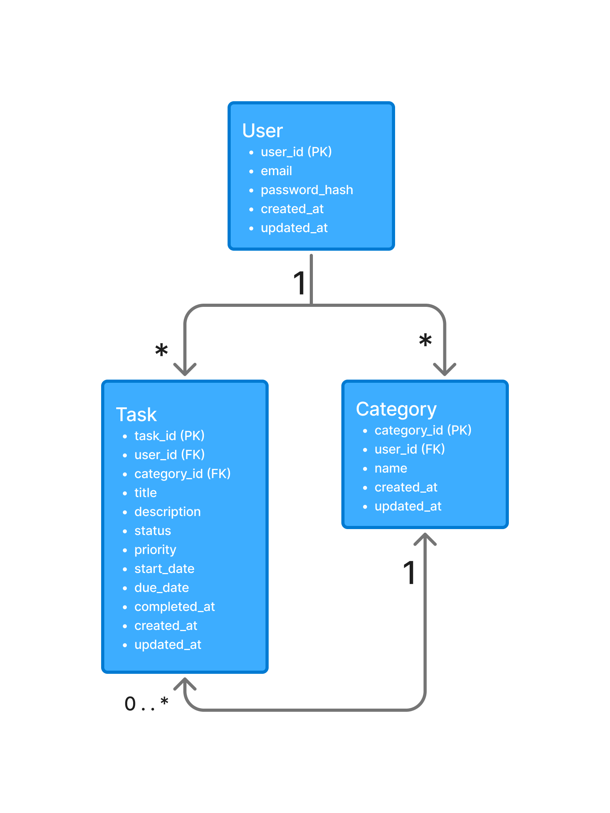

---

# Running the Tests

The frontend test suite can be run from the `frontend` directory.

Install dependencies first:

```bash
npm install
```

Run the complete test suite:

```bash
npx vitest run
```

To run the tests in watch mode:

```bash
npx vitest
```

The tests cover the major user-facing components and behaviors of the application.

Examples include:

* Login.
* Registration.
* Dashboard.
* Tasks.
* Task filtering.
* Task pagination.
* Categories.
* Summary cards.
* Task rows.
* Status badges.
* Priority indicators.
* Reusable UI components.

A successful test run should report all implemented tests as passing.

---

# Application Screenshots

The following screenshots are included to make the project understandable without requiring the reviewer to run the application first.

## Registration

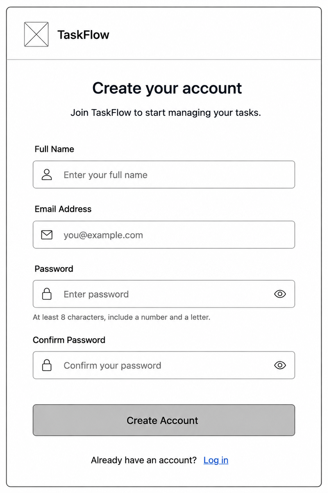

The registration screen allows a new user to create an account.

## Login

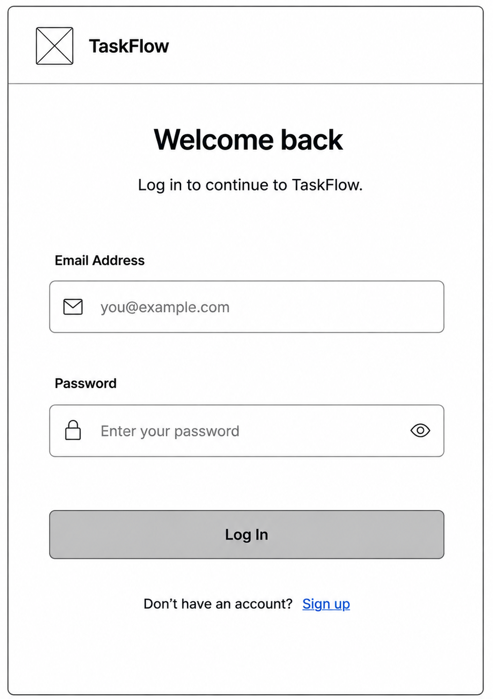

The login screen allows an existing user to access their account.

## Dashboard

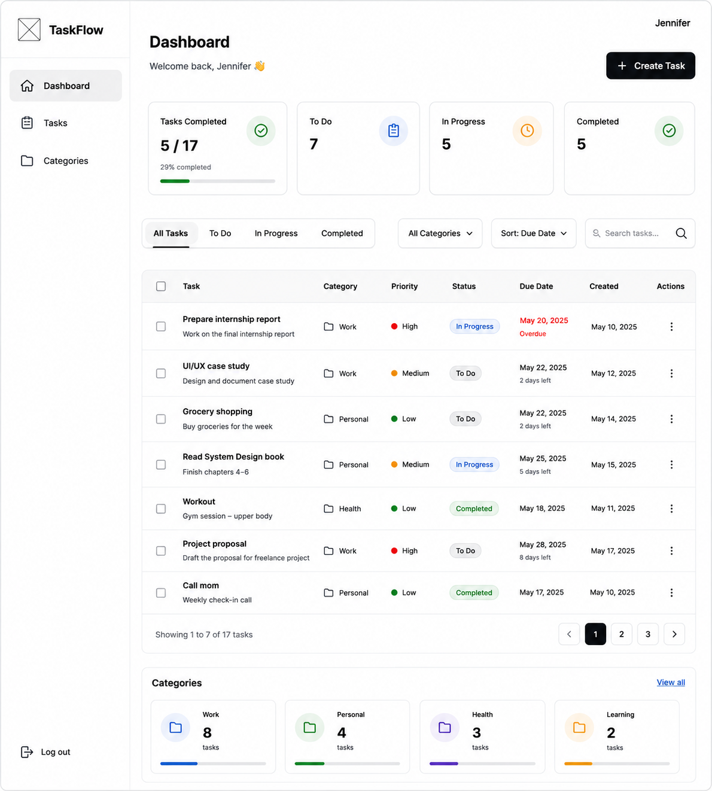

The dashboard provides an overview of task progress and gives the user a starting point for managing their work.

## Empty Dashboard

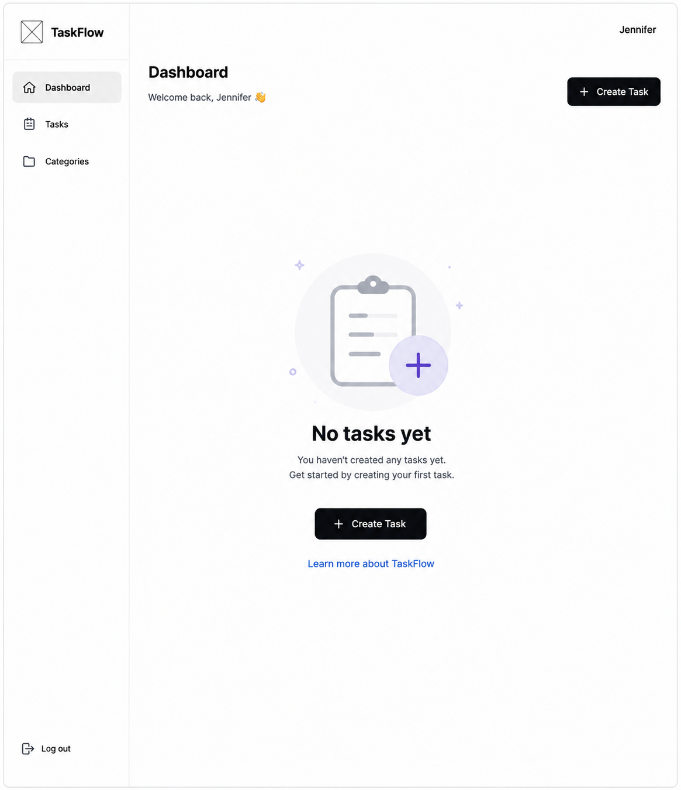

The empty dashboard demonstrates how the application behaves when a user has not created tasks yet.

## Tasks

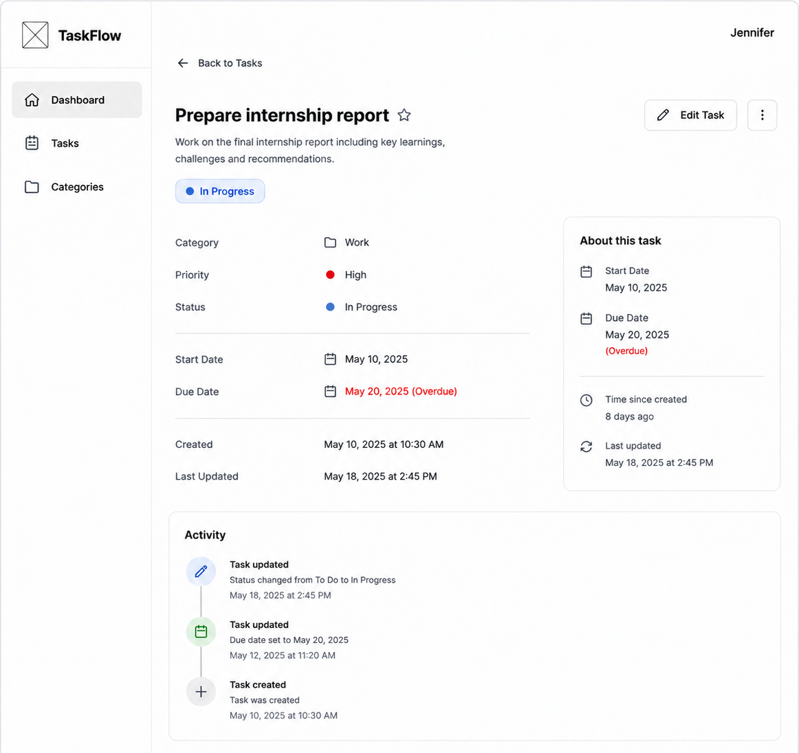

The task interface allows users to view and manage task information.

## Create Task

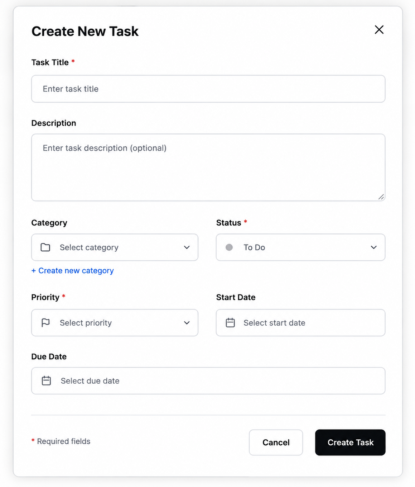

The create-task interface allows a user to enter the information required for a new task.

## Edit Task

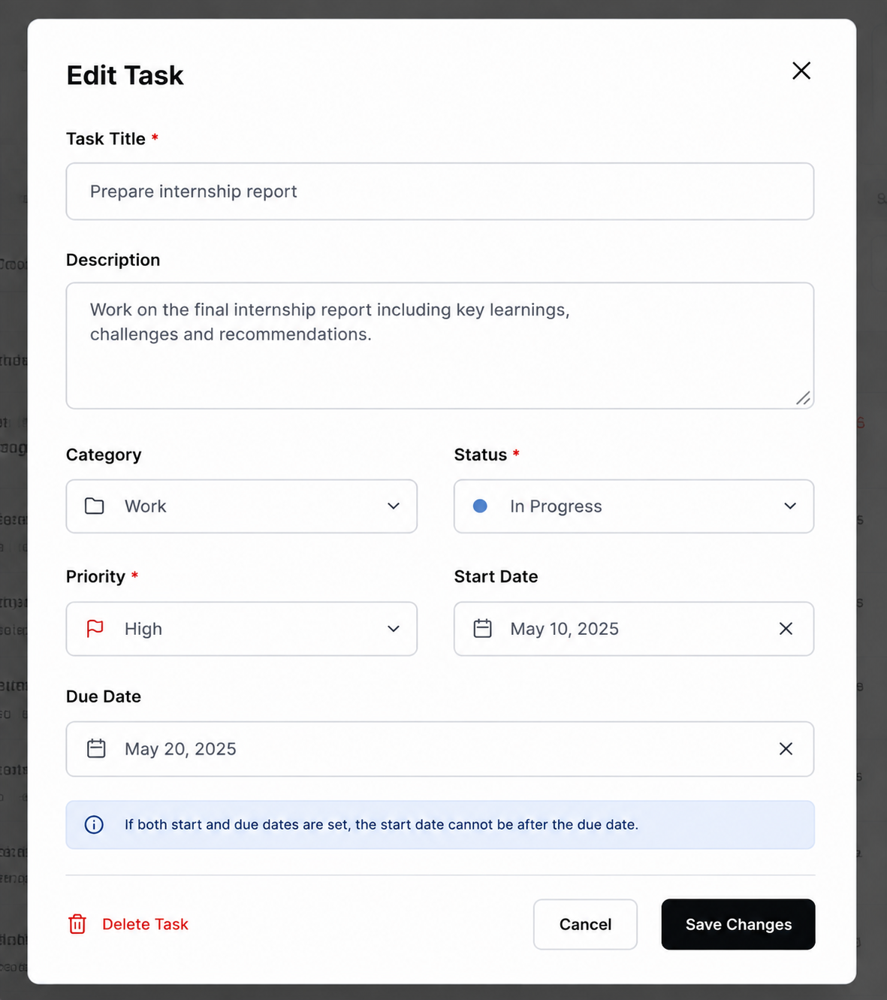

The edit-task interface allows an existing task to be updated.

## Categories

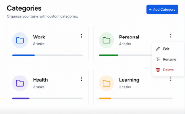

The categories interface allows users to organize tasks into groups.

## Create Category

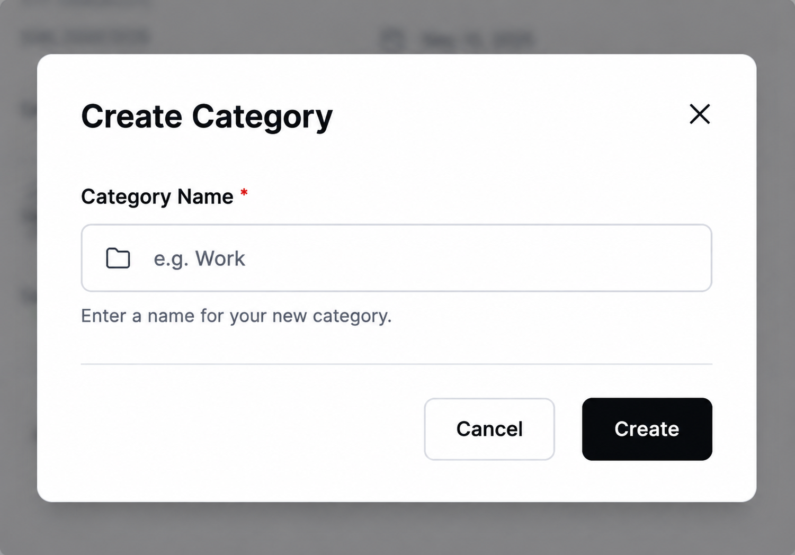

The create-category interface allows users to create a new category.

---

# System Architecture

The overall architecture is documented in:

[Architecture Documentation](docs/architecture.md)

A visual representation is provided below.

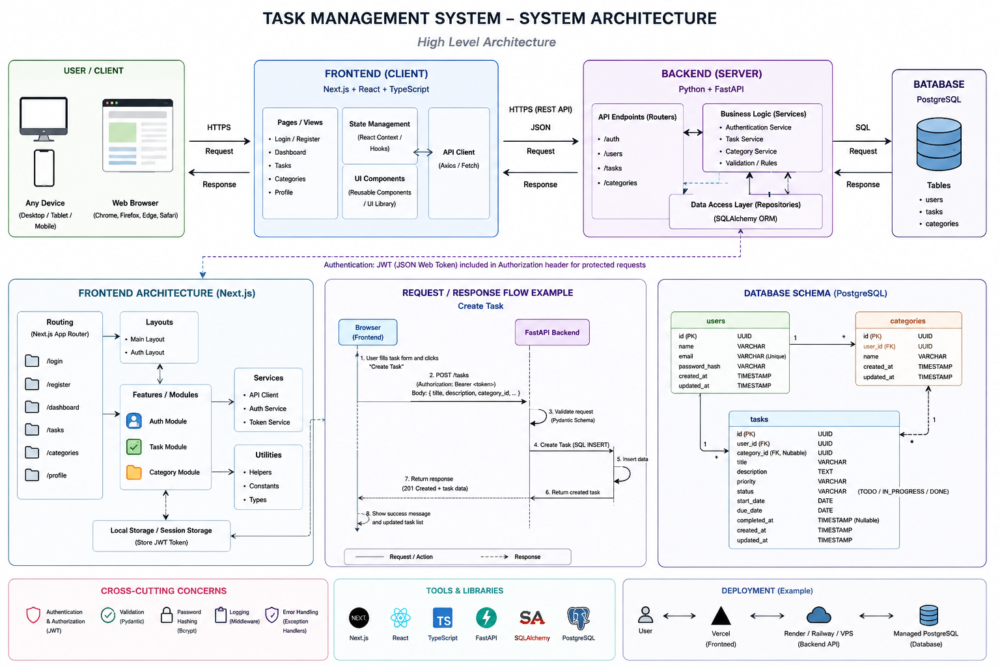

The application follows a separation between:

1. Presentation.
2. Application/API logic.
3. Persistent data.

This structure makes the system easier to understand and maintain.

---

# API Documentation

The API design and endpoint definitions are documented in:

[API Documentation](docs/api.md)

The API provides operations for the major application resources, including authentication, tasks, and categories.

The API is designed around standard HTTP operations.

Examples include:

```text
POST   /auth/register
POST   /auth/login

GET    /tasks
POST   /tasks
GET    /tasks/{task_id}
PATCH  /tasks/{task_id}
DELETE /tasks/{task_id}

GET    /categories
POST   /categories
PATCH  /categories/{category_id}
DELETE /categories/{category_id}
```

The exact implemented endpoints and request/response structures should be considered authoritative in `docs/api.md`.

---

# Data Model

TaskFlow uses a relational data model centered around three primary entities:

```text
User
 |
 +----< Task >---- Category
```

A user can have multiple tasks.

A category can contain multiple tasks.

A task can optionally belong to a category.

The detailed model, fields, relationships, and constraints are documented in:

[Data Model](docs/data-model.md)

The visual ERD is:


---

# User Flows

The application's major user flows are documented separately so that the behavior can be understood independently of the implementation.

See:

[User Flows](docs/user-flows.md)

The main visual flows include:

## Authentication Flow


## Dashboard Flow


## Categories Flow

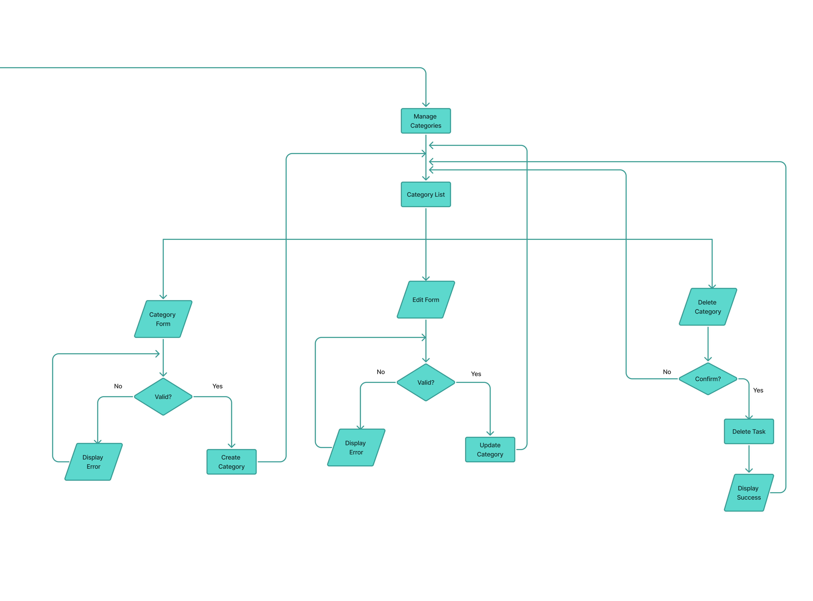

These diagrams describe how users move through the application rather than how the underlying code is implemented.

---

# Design Decisions and Trade-offs

Several decisions were made to keep the application understandable and appropriately scoped.

## Simple Task Statuses

TaskFlow uses three primary task statuses:

* To Do
* In Progress
* Done

An `Overdue` state was not added as a permanent status.

Instead, whether a task is overdue can be determined from its due date.

### Why?

An overdue task may still be:

* To Do.
* In Progress.
* Done.

Making `Overdue` a permanent status would mix two different concepts: task progress and time.

Keeping them separate makes the data model easier to understand.

---

## Category-Based Organization

Categories provide a lightweight way to organize tasks without introducing a much larger project-management hierarchy.

This keeps the application useful without adding unnecessary complexity.

---

## Reusable UI Components

Common interface elements are implemented as reusable components.

Examples include:

* Buttons.
* Inputs.
* Cards.
* Badges.
* Task rows.
* Summary cards.
* Category cards.

### Why?

Reusable components reduce duplicated code and make visual changes easier to apply consistently.

---

## Client-Side UI State

The frontend manages temporary interface state such as:

* Loading indicators.
* Modal visibility.
* Filters.
* Form interaction.
* Pagination state.

Persistent information belongs to the backend and database rather than being treated as permanent frontend state.

---

## Automated Testing

Important UI behavior is covered by automated tests.

This was chosen instead of relying exclusively on manual browser testing.

### Trade-off

Writing tests takes additional development time, but it provides a repeatable way to verify that important functionality continues to work after changes.

---

## Scope Versus Time

The project prioritizes the core task-management experience instead of attempting to implement every possible productivity feature.

This keeps the initial application focused on:

* Authentication.
* Tasks.
* Categories.
* Status.
* Priority.
* Dashboard progress.
* Basic filtering and pagination.

More advanced productivity features are treated as future enhancements.

---

# Known Limitations

The current submission has several limitations.

## No Live Production Deployment

A production deployment is not currently included.

The application is therefore provided with local setup instructions rather than a production URL.

This README explains how a reviewer can run the project locally.

---

## Backend Environment Setup

The backend requires a configured Python environment and PostgreSQL database.

A reviewer must provide those local dependencies before running the backend.

---

## No Production Infrastructure

The project does not currently include a production infrastructure configuration.

This means there is no production hosting environment, managed production database, or deployed API URL included with the submission.

---

# Future Enhancements

If development continued beyond the current scope, the following improvements would be strong candidates.

## Production Deployment

Deploy the frontend and backend to production and provide a live URL.

---

## Password Recovery

Add a secure password-reset flow so users can recover access to their accounts.

---

## Notifications

Provide reminders for approaching or overdue tasks.

---

## Recurring Tasks

Allow users to create tasks that repeat automatically.

Examples include:

* Daily tasks.
* Weekly tasks.
* Monthly tasks.

---

## Richer Dashboard Analytics

The dashboard could eventually include:

* Completion trends.
* Tasks completed per week.
* Category distribution.
* Productivity history.

---

## Mobile Optimization

Continue improving the experience for smaller screens and mobile devices.

---

## Deployment Automation

Introduce continuous integration and deployment so that tests run automatically when changes are pushed and approved changes can be deployed safely.

---

# Documentation

The project documentation is divided into focused documents rather than placing every design decision in the README.

| Document                               | Purpose                                             |
| -------------------------------------- | --------------------------------------------------- |
| [Requirements](docs/requirements.md)   | Project requirements, scope, rules, and constraints |
| [User Stories](docs/user-stories.md)   | User goals and expected behavior                    |
| [Data Model](docs/data-model.md)       | Database entities and relationships                 |
| [User Flows](docs/user-flows.md)       | Main user journeys through the application          |
| [Architecture](docs/architecture.md)   | Technical system structure                          |
| [API](docs/api.md)                     | API endpoints and contracts                         |
| [UI Wireframes](docs/ui-wireframes.md) | Planned interface and screen designs                |

The documentation is intended to allow someone to understand the project at three levels:

1. **What the application does** — requirements and user stories.
2. **How users interact with it** — user flows and wireframes.
3. **How the application is built** — architecture, data model, and API.

---

# Live Demo

There is currently **no live production demo** for TaskFlow.

The application can instead be reviewed using the provided screenshots and by following the local setup instructions in this README.

The screenshots are included so that a reviewer can understand the intended user experience without needing to deploy the application first.

---

# Final Notes for Reviewers

TaskFlow was designed as a focused task-management application rather than a large project-management platform.

The main goal was to demonstrate a complete product-thinking process:

```text
Requirements
     |
     v
User Stories
     |
     v
User Flows
     |
     v
Wireframes
     |
     v
Architecture
     |
     v
Data Model
     |
     v
API Design
     |
     v
Implementation
     |
     v
Automated Testing
```

The repository therefore contains both the implementation and the design documentation used to guide that implementation.

For a quick review, start with:

1. [Requirements](docs/requirements.md)
2. [User Stories](docs/user-stories.md)
3. [User Flows](docs/user-flows.md)
4. [UI Wireframes](docs/ui-wireframes.md)
5. [Architecture](docs/architecture.md)
6. [Data Model](docs/data-model.md)
7. [API Documentation](docs/api.md)

Then follow the [Getting Started](#getting-started) instructions to run the application locally.
