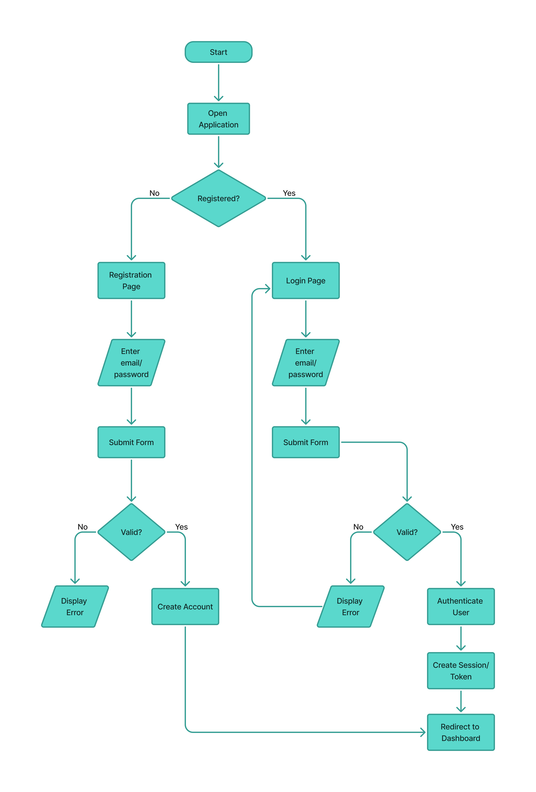

# TaskFlow — User Flows

## 1. Overview

This document describes the primary user journeys within TaskFlow.

The flows illustrate how a user moves through the application to authenticate,
manage tasks, and manage categories.

The user flows are designed to keep the application simple and intuitive while
covering the core functionality defined in the project requirements.

---

# 2. Authentication Flow

## 2.1 Purpose

The authentication flow allows a new user to create a TaskFlow account and
allows an existing user to securely access their account.

A user must be authenticated before accessing their tasks and categories.

## 2.2 Authentication Journey

The authentication journey begins when the user opens TaskFlow.

The system determines whether the user already has an account.

### Existing User

An existing user proceeds to the login page and provides:

- Email address
- Password

If the credentials are valid, the user is authenticated and redirected to the
dashboard.

If the credentials are invalid, an appropriate error message is displayed and
the user remains on the login page.

### New User

A new user proceeds to the registration page and provides:

- Full name
- Email address
- Password
- Confirm password

The registration form is validated before an account is created.

If validation succeeds, the account is created and the user can proceed to
login.

If validation fails, the relevant error is displayed and the user can correct
the submitted information.

## 2.3 Authentication Flow Diagram

---

# 3. Dashboard Flow

## 3.1 Purpose

The dashboard provides the authenticated user with an overview of their tasks
and access to the main task and category management functionality.

The dashboard includes:

- Task completion summary
- Task status overview
- Task list
- Task search/filtering
- Create task action
- Navigation to task management
- Navigation to category management
- Logout

## 3.2 Dashboard Journey

After successful authentication, the user is redirected to the dashboard.

The user can then:

1. View their task summary.
2. View tasks and their current statuses.
3. Search or filter tasks.
4. Create a new task.
5. Open a task to view its details.
6. Edit an existing task.
7. Update a task's status.
8. Delete a task.
9. Navigate to category management.
10. Log out.

## 3.3 Dashboard Flow Diagram

---

# 4. Task Management Flow

## 4.1 Create Task

A user can create a task from the dashboard or task management interface.

The user provides the required and optional task information.

### Required Information

- Title

### Optional Information

- Description
- Status
- Priority
- Start date
- Due date
- Category

The system validates the submitted information.

If validation succeeds:

User → Submit task → Backend validation → Create task → Persist task → Return created task → Update interface

If validation fails, the relevant validation error is displayed and the user
can correct the information.

After a task is successfully created, the user can select the task from the
task list to view its details.

## 4.2 View Task

A user can select a task from the task list to view its details.

The task details page displays:

- Title
- Description
- Status
- Priority
- Category
- Start date
- Due date
- Completion information
- Created date
- Updated date

The user can then edit or delete the task.

## 4.3 Edit Task

A user can edit an existing task.

The user may update:

- Title
- Description
- Status
- Priority
- Start date
- Due date
- Category

The updated information is validated before the task is saved.

After a successful update, the task list and task details reflect the latest
information.

## 4.4 Update Task Status

A user can change a task's status between:

- TODO
- IN_PROGRESS
- DONE

Status transitions are intentionally flexible.

A task is not required to follow a fixed progression.

For example:

TODO → IN_PROGRESS → DONE

is valid, but so are:

DONE → IN_PROGRESS

IN_PROGRESS → TODO

TODO → DONE

This allows users to correct mistakes or reopen previously completed tasks.

## 4.5 Delete Task

A user can delete a task that they own.

The system verifies that the task belongs to the authenticated user before
deleting it.

After successful deletion, the task is removed from the user's task list.

## 4.6 Overdue Tasks

A task is considered overdue when:

due_date < current time

AND

status != DONE

OVERDUE is not stored as a separate task status.

Instead, the overdue state is derived from the task's due date and current
status.

The interface communicates this state using an OVERDUE visual indicator or
badge.

---

# 5. Category Management Flow

## 5.1 Purpose

Categories allow users to organize their tasks according to their own needs.

Categories are user-defined rather than globally fixed by the application.

Examples include:

- Work
- Family
- Personal
- School
- Errands

These are only examples. Users can create categories according to their own
needs.

## 5.2 View Categories

The user can navigate to the category management section.

The system displays the categories belonging to the authenticated user.

A category can contain zero or many tasks.

## 5.3 Create Category

The user selects the Add Category action.

A small modal is displayed asking for:

- Category name

The category name is validated before the category is created.

If successful, the new category appears in the category list.

## 5.4 Edit Category

The user can edit an existing category name.

The updated name is validated before the change is saved.

Renaming a category does not affect the tasks assigned to that category.

For example:

Work → Professional

Tasks previously assigned to Work remain assigned to the renamed category.

## 5.5 Delete Category

The user can delete a category.

Deleting a category does not delete the tasks associated with it.

Instead, affected tasks become uncategorized.

For example:

Before:

Work
- Task A
- Task B
- Task C

After deleting Work:

Task A → Uncategorized
Task B → Uncategorized
Task C → Uncategorized

This prevents accidental deletion of user tasks.

## 5.6 Assign a Task to a Category

When creating or editing a task, the user can optionally select a category.

A task can belong to:

- One category
- No category

A task can also be moved from one category to another.

For example:

Work → Family

The task remains the same; only its category association changes.

---

# 6. Empty State Flow

## 6.1 No Tasks

When a user has no tasks, the dashboard displays an empty state rather than
an empty task list.

The user is shown:

No tasks yet

along with a Create Task action.

This clearly communicates that no tasks have been created and provides the
user with an immediate next action.

## 6.2 No Categories

When a user has no categories, the category management interface displays an
appropriate empty state and provides an Add Category action.

---

# 7. Logout Flow

A user can log out from the application through the logout action.

The logout process ends the user's authenticated session.

After logout, the user is redirected to the appropriate unauthenticated
screen and must authenticate again to access protected application resources.

---

# 8. Access Control

All task and category management operations are performed within the context
of the authenticated user.

A user can only:

- View their own tasks.
- Create tasks for themselves.
- Update their own tasks.
- Delete their own tasks.
- View their own categories.
- Create their own categories.
- Update their own categories.
- Delete their own categories.

The backend is responsible for enforcing ownership.

The frontend should not be relied upon as the security boundary.